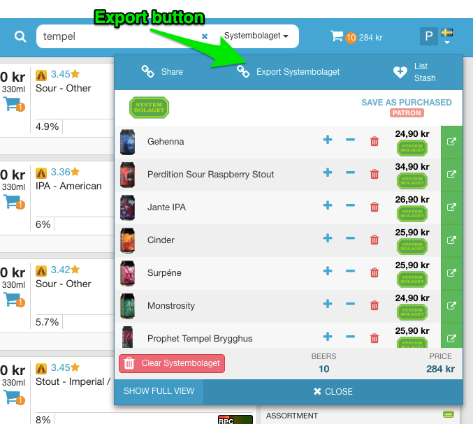
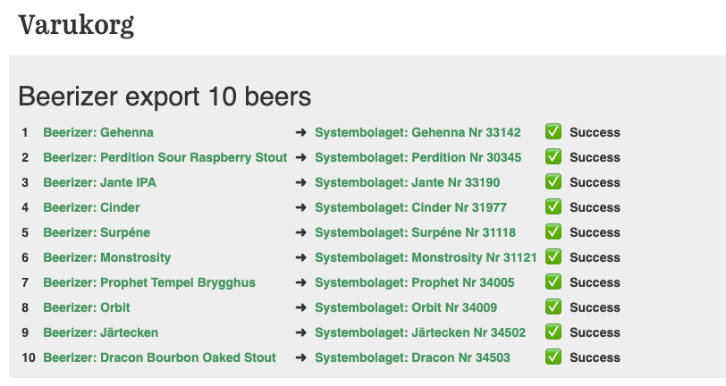

# Beerizer export Systembolaget userscript

## Description
Adds an Systembolaget export button to top of the Beerizer.com cart (Fig. 1).
The result of the export can be verifed in the Systembolaget.se cart (Fig. 3).

Fig 1. export button

Fig 2. export progress

Fig 3. export result

## Installation
1. Install a userscript manager, e.g. [Tampermonkey](https://www.tampermonkey.net/).
1. Open the raw user.js file here: 
   [beerizer-systembolaget-export.user.js](../../raw/master/beerizer-systembolaget-export.user.js)
1. Tampermonkey should handle the installation.
1. Go to Beerizer.com and order some beers! 🍺

## Contributing
* File issues and feature requests in the [issue-tracker](/issues).
* All the source code is in the [beerizer-systembolaget-export.user.js](blob/master/beerizer-systembolaget-export.user.js)
* Use npm and eslint to lint the code.
